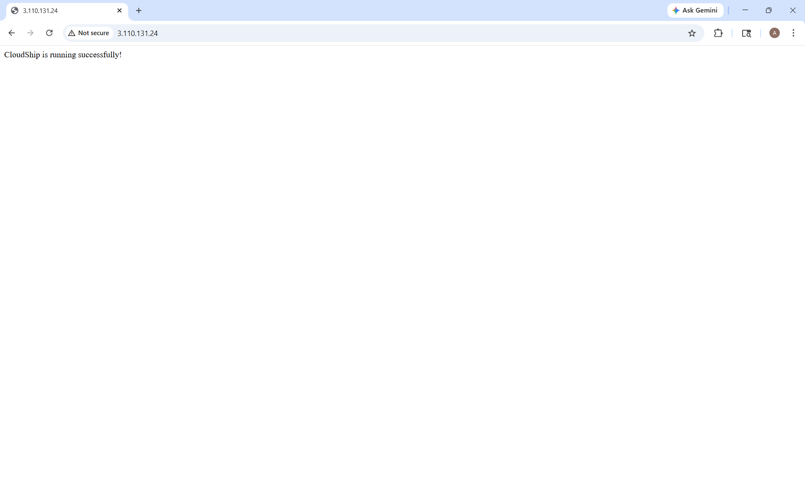
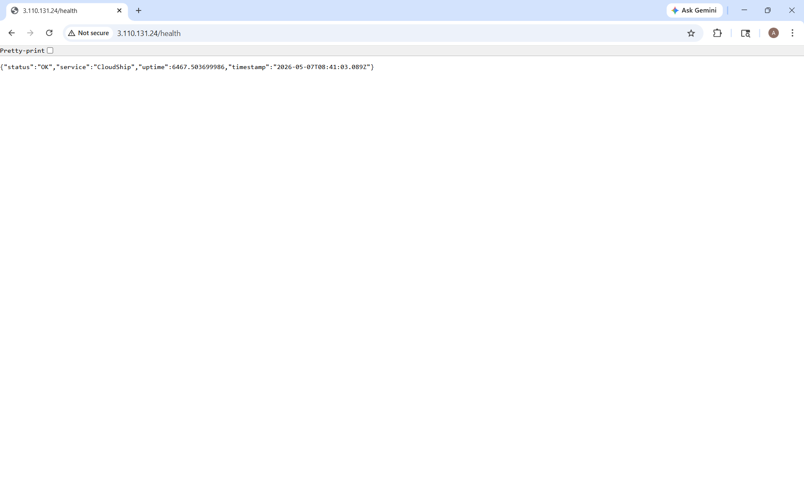
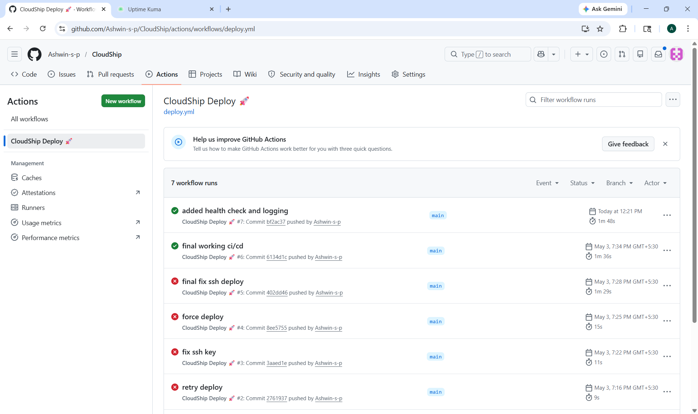
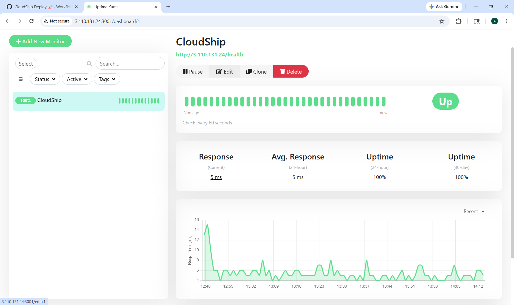
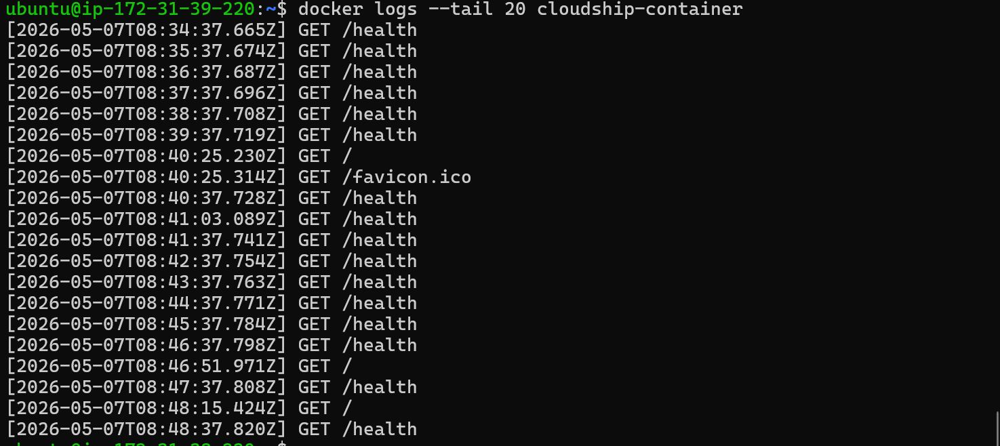

# 🚀 CloudShip – Production-Style DevOps Deployment System

CloudShip is a production-style DevOps project built using Node.js, Docker, AWS EC2, Nginx, GitHub Actions CI/CD, and monitoring tools.

This project demonstrates real-world deployment practices including containerization, automated deployment pipelines, reverse proxy configuration, health monitoring, logging, and uptime tracking.

---

# 📌 Features

✅ Dockerized Node.js Application  
✅ AWS EC2 Deployment  
✅ GitHub Actions CI/CD Pipeline  
✅ Nginx Reverse Proxy  
✅ Health Check Endpoint  
✅ Request Logging  
✅ Uptime Monitoring using Uptime Kuma  
✅ Public Cloud Deployment  
✅ Automated Container Deployment  

---

# 🛠️ Tech Stack

- Node.js
- Express.js
- Docker
- AWS EC2
- GitHub Actions
- Nginx
- Uptime Kuma
- Linux (Ubuntu)

---

# 🏗️ Project Architecture

```text
User
  ↓
Nginx Reverse Proxy
  ↓
Docker Container
  ↓
Node.js Application
  ↓
Health Monitoring & Logging
  ↓
Uptime Kuma Monitoring
```

---

# ⚙️ CI/CD Workflow

1. Developer pushes code to GitHub  
2. GitHub Actions pipeline triggers automatically  
3. GitHub Actions connects to AWS EC2 using SSH  
4. Existing Docker container stops  
5. New Docker image builds automatically  
6. Updated container deploys automatically  
7. Nginx routes traffic to the application  

---

# ❤️ Health Monitoring

The application includes a dedicated health monitoring endpoint:

```bash
/health
```

This endpoint is continuously monitored using Uptime Kuma for uptime tracking and availability checks.

---

# 📜 Request Logging

CloudShip includes request-level logging to monitor incoming traffic and observe public internet requests hitting the deployed server.

Example logs:

```bash
GET /
GET /health
GET /.env
```

---

# 📸 Screenshots

## 🟢 Application Running



---

## 🟢 Health Endpoint



---

## 🟢 GitHub Actions CI/CD



---

## 🟢 Uptime Kuma Monitoring



---

## 🟢 Docker Logs



---

# 🚀 Deployment Steps

## Clone Repository

```bash
git clone https://github.com/Ashwin-s-p/CloudShip.git
```

---

## Install Dependencies

```bash
npm install
```

---

## Run Application

```bash
node app.js
```

---

## Build Docker Image

```bash
docker build -t cloudship-app .
```

---

## Run Docker Container

```bash
docker run -d -p 3000:3000 --name cloudship-container cloudship-app
```

---

# 🌐 Live Deployment

Application deployed on AWS EC2 using Docker and Nginx.

---

# 📈 Future Improvements

- HTTPS & Custom Domain
- Terraform Infrastructure Automation
- Grafana Dashboard
- Prometheus Metrics
- ECS & ECR Deployment
- Load Balancer Integration

---

# 👨‍💻 Author

Ashwin Poojary

GitHub: https://github.com/Ashwin-s-p